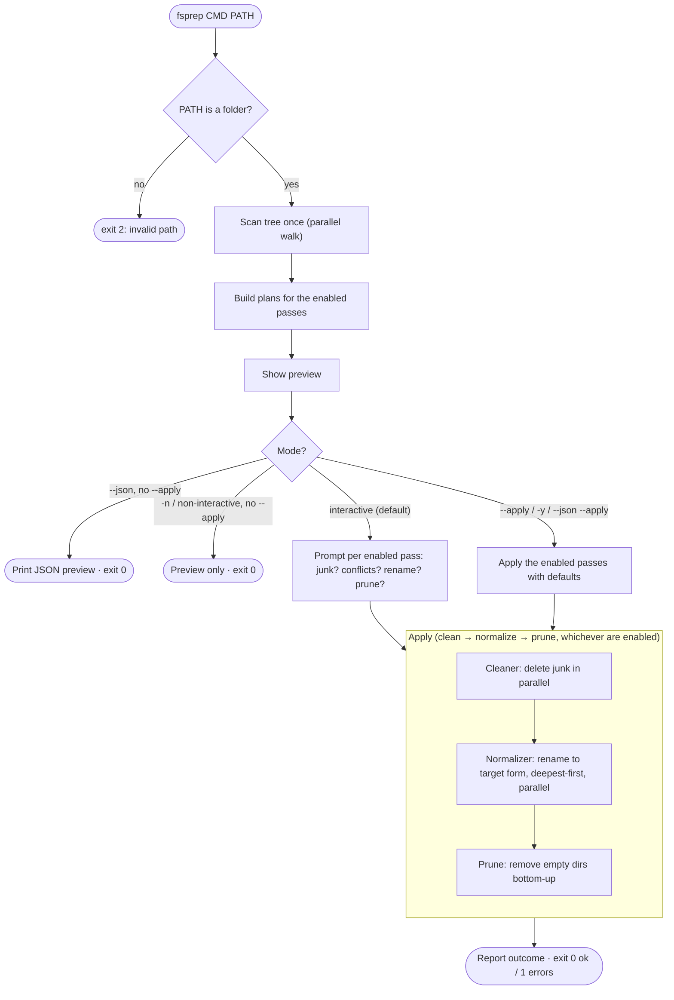

# fsprep

A command-line tool to **prepare a filesystem tree for archival or transfer** (e.g. writing
to LTFS tape). It does three things, each available as its own subcommand:

- **`normalize`** — rename file/folder names from **NFD (decomposed) to NFC (composed)** form
  in place (or any Unicode form via `--form`; **NFKC** also folds full-width/compatibility
  characters). With `--sanitize` it also rewrites characters illegal on Windows/LTFS, strips
  trailing dots/spaces, and escapes reserved device names.
- **`clean`** — delete OS-generated junk (`.DS_Store`, `._*` AppleDouble, `Thumbs.db`,
  `desktop.ini`, `.Spotlight-V100`, `__MACOSX`, ...), plus your own patterns via `--junk-glob`.
- **`prune`** — remove empty directories (bottom-up).
- **`all`** — the full suite: **clean → normalize → prune** in one pass.

macOS-origin filenames are often stored in NFD Unicode form, which causes compatibility
problems when written to LTFS (e.g. dakuten/handakuten separated from their base character).
Renaming touches names only; **it does not move file data** (a metadata-only operation). Junk
cleanup deletes well-known OS cruft so it does not end up on the tape.

## Features

- **Dry run by default** (preview). In an interactive terminal it then offers to proceed;
  non-interactive/`--json` runs stay preview-only — pass `--apply` to make changes
- Recurses into subfolders (use `--no-recursive` for direct children only)
- **Does not follow symlinks** (only the link's own name is considered)
- Detects **conflicts** (the target name already exists): skip by default, or **overwrite**
  the existing file (destructive — see `--on-conflict`)
- Fixed, safe pass order in `all`: junk is removed *before* renaming so captured paths stay
  valid; pruning runs *last* against the live tree
- **Operation log** (`--log FILE`): a CSV record of every rename/delete/prune for audit
- **Parallelized for network drives**; child → parent rename order is guaranteed
- **Zero dependencies** (Python standard library only)

## Requirements

- Python 3.12+
- No third-party runtime dependencies (Python standard library only)

## Setup

With [uv](https://docs.astral.sh/uv/):

```bash
uv sync
```

## Usage

```text
fsprep {normalize,clean,prune,all} PATH [options]
```

```bash
# Preview a full run, then (in an interactive terminal) get asked whether to proceed
uv run fsprep all /path/to/folder

# Normalize names only, applying without prompts (scripting)
uv run fsprep normalize /path/to/folder --apply -y --workers 16

# Delete OS junk only, with an audit log
uv run fsprep clean /path/to/folder --apply -y --log prep.csv

# Full suite, folding full-width/compatibility characters and sanitizing illegal ones
uv run fsprep all /path/to/folder --apply -y --form NFKC --sanitize

# Full suite that also sweeps custom junk and prunes the empty dirs left behind
uv run fsprep all /path/to/folder --apply -y --junk-glob '*.tmp'

# Remove empty directories only
uv run fsprep prune /path/to/folder --apply -y

# Overwrite conflicting files instead of skipping them (destructive)
uv run fsprep normalize /path/to/folder --apply -y --on-conflict overwrite
```

Each subcommand is **dry-run by default**. When run in an interactive terminal without
`--apply`, it shows the preview and then asks per pass whether to proceed (delete junk?
handle conflicts? confirm rename? prune?). With `--json`, when piped, or when stdin is not a
terminal, it stays preview-only and never prompts; use `--apply` to act non-interactively.

### Subcommands

| Subcommand | What it does | Extra options |
|---|---|---|
| `normalize` (`norm`) | Rename names to a normalization form, optionally sanitized | `--form`, `--sanitize`, `--on-conflict`, `--show-conflicts` |
| `clean` | Delete OS-generated junk files/folders | `--junk-glob` |
| `prune` | Remove empty directories (bottom-up) | — |
| `all` | Full suite: clean → normalize → prune | all of the above |

### Common options (every subcommand)

| Option | Description |
|---|---|
| `--apply` | Make changes without prompting (dry run otherwise; an interactive terminal still offers to proceed) |
| `-n, --dry-run` | Preview only: never prompt and never make changes (mutually exclusive with `--apply`) |
| `-w, --workers N` | Worker count (default 16; higher for network, 4–8 for local) |
| `-y, --yes` | Skip the confirmation prompt |
| `--log FILE` | Write a CSV operation log of all changes |
| `--no-recursive` | Direct children only (do not descend into subfolders) |
| `--full` | Show the full preview (default is the first 50) |
| `--json` | Emit machine-readable JSON to stdout (progress/info go to stderr; never prompts) |

### Pass-specific options

| Option | Used by | Description |
|---|---|---|
| `--form {NFC,NFD,NFKC,NFKD}` | `normalize`, `all` | Unicode normalization form (default `NFC`). `NFKC`/`NFKD` also fold compatibility characters (e.g. full-width → half-width, ligatures, circled digits) |
| `--sanitize` | `normalize`, `all` | Also rewrite characters illegal on Windows/LTFS (`<>:"\|?*` and control chars) to `_`, strip trailing dots/spaces, and escape reserved device names (`CON`, `NUL`, ...). Off by default |
| `--on-conflict {skip,overwrite}` | `normalize`, `all` | Conflict handling (default: skip; `overwrite` replaces existing files and is destructive) |
| `--show-conflicts` | `normalize`, `all` | Include conflict items in the preview |
| `--junk-glob GLOB` | `clean`, `all` | Additional junk name pattern to delete (case-insensitive fnmatch, repeatable), e.g. `--junk-glob '*.tmp'` |

Progress and info go to **stderr**; `--json` output goes to **stdout** (UTF-8, so non-ASCII
names survive redirection on Windows).

Exit codes: 0 = success / 1 = aborted or completed with errors / 2 = invalid path.

## Tests

```bash
uv run pytest
```

## Lifecycle

Every run scans the tree once, shows a preview, then (depending on mode) applies the passes
enabled by the chosen subcommand. `all` runs them in the fixed order **clean → normalize →
prune**:



The order matters: junk is removed **before** renaming so the paths captured during the scan
stay valid (renaming an ancestor directory first would invalidate them), and empty-directory
pruning runs **last** against the live tree, because what counts as empty depends on the junk
that was just removed.

## Layout

The passes run in the fixed order **cleaner → normalizer → prune** (junk is removed before
renaming so captured paths stay valid; pruning runs last on the live tree):

- `src/fsprep/core.py` — shared infrastructure (parallel directory walker, error/log types)
- `src/fsprep/scan.py` — single-pass scan producing the plans (one tree walk)
- `src/fsprep/clean.py` — junk pass (matching incl. custom globs, parallel deletion) — the `clean` subcommand
- `src/fsprep/normalize.py` — rename pass (form normalization + sanitize, depth-ordered parallel rename, conflict detection) — the `normalize` subcommand
- `src/fsprep/prune.py` — empty-directory pruning (bottom-up) — the `prune` subcommand
- `src/fsprep/__main__.py` — CLI (argparse subcommands, progress, CSV log; `all` orchestrates the passes); `fsprep` / `python -m fsprep`

## Roadmap

- **Case-collision detection** — flag names that differ only by case (e.g. `Foo.txt` /
  `foo.txt`), which collapse into one file on case-insensitive targets (macOS/Windows). This
  needs sibling-name grouping (comparing entries within each directory) rather than the
  current per-entry classification, so it is planned as a follow-up.
